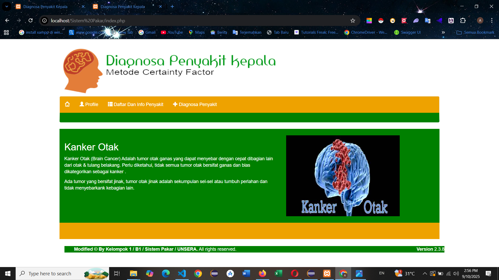

## Diagnosa penyakit kepala menggunakan metode certainty factor (cf)
Project yang saya buat ini berhubungan dengan Diagnosa penyakit kepala atau migrain Menggunakan metode certainty factor (cf) 

### 1. Rancangan Menu Utama User

### 2. Tampilan Menu Utama

### 3. Tampilan Informasi Penyakit 

### 4. Rancangan Form Registrasi Dignosa penyakit

### 5. Rancangan Konsultasi

### 6. Rancangan Hasil Konsultasi

